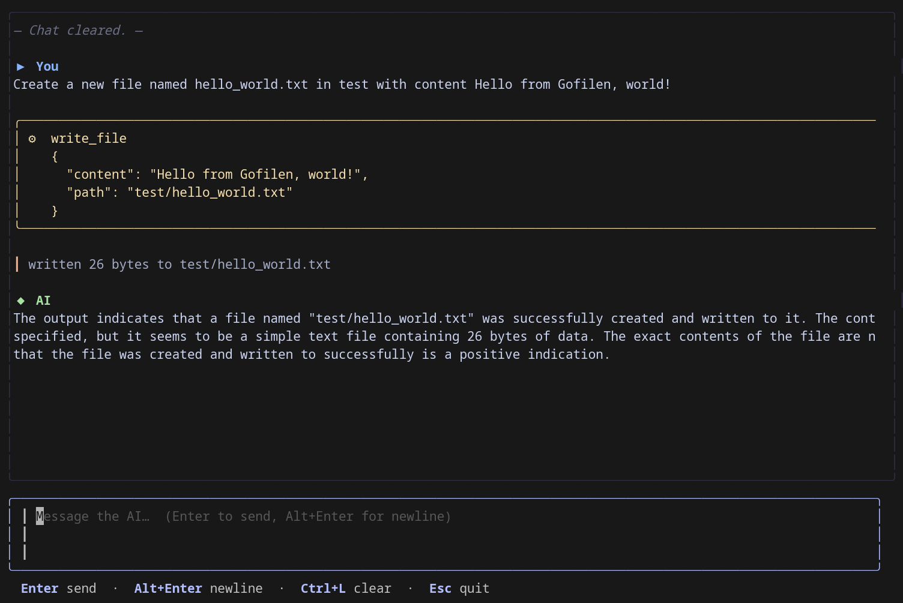

# gofilen




An interactive terminal chat application for your [Filen](https://filen.io) cloud drive, powered by a local LLM via [Ollama](https://ollama.com).

Ask the AI to list, read, write, move, copy, and delete files on your Filen drive — all from the terminal, fully private.

```
┌ ⬡ gofilen  ~/filen  llama3.2 ────────────────────────────────────┐
│                                                                    │
│  — Filen drive: ~/filen  •  model: llama3.2 —                     │
│                                                                    │
│  ▶ You                                                             │
│  list my files and summarise what's in documents/                  │
│                                                                    │
│  ◆ AI                                                              │
│  ╭─ list_files ──────────────────────╮                             │
│  │  ⚙  list_files                    │                             │
│  │     { "path": "." }               │                             │
│  ╰───────────────────────────────────╯                             │
│  │ documents/  2025-01-10 14:32                                    │
│  │ notes.txt   2025-03-01 09:15                                    │
│                                                                    │
│  You have 2 items at the root. Let me look inside documents/…      │
└────────────────────────────────────────────────────────────────────┘
  Enter  send  ·  Alt+Enter  newline  ·  Ctrl+L  clear  ·  Esc  quit
```

## Requirements

- [Ollama](https://ollama.com) running locally (`ollama serve`)
- A model that supports tool/function calling (e.g. `llama3.2`, `qwen2.5`, `mistral-nemo`)

```bash
ollama pull llama3.2
```

## Installation

```bash
go install github.com/t0mtait/gofilen@latest
```

Or build from source:

```bash
git clone https://github.com/t0mtait/gofilen
cd gofilen
go build -o gofilen .
```

## Usage

```bash
# Defaults: --dir ~/filen  --model llama3.2  --ollama http://localhost:11434
gofilen

# Custom options
gofilen --dir /mnt/filen --model qwen2.5 --ollama http://192.168.1.10:11434
```

## What the AI can do

| Action | Example prompt |
|--------|---------------|
| List files | "what's in my documents folder?" |
| Read a file | "show me the contents of notes.txt" |
| Write a file | "create a file called todo.txt with my three tasks: …" |
| Create directories | "make a folder called projects/2025" |
| Move / rename | "rename report-draft.docx to report-final.docx" |
| Copy | "copy my notes to a backup folder" |
| Delete | "delete all files in the temp/ directory" |

All file operations are sandboxed to the Filen mount directory — paths cannot escape it.
